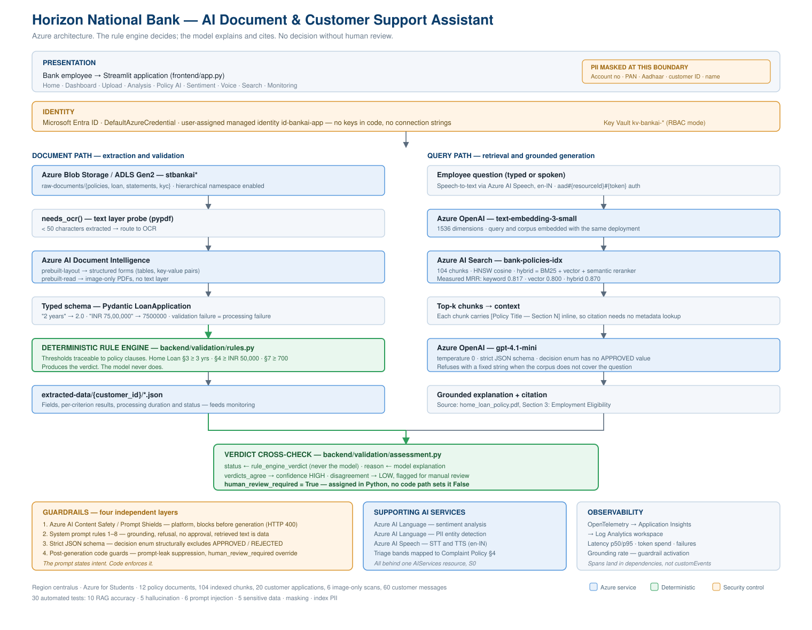
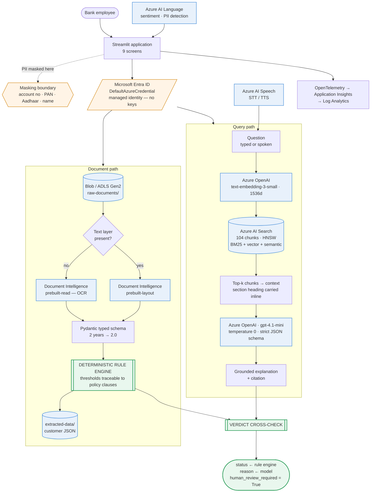

# Architecture

Horizon National Bank — AI Document & Customer Support Assistant.

## Diagram (renders on GitHub)

## The two paths

**Document path** turns a PDF into a verdict. Files land in ADLS Gen2, a text-layer
probe decides whether OCR is needed, Document Intelligence extracts fields, Pydantic
coerces them to real types, and a deterministic rule engine compares them against
policy thresholds. The result is persisted as JSON partitioned by customer.

**Query path** turns a question into a cited answer. The question is embedded with
the same deployment used for the corpus, hybrid retrieval returns the top chunks,
and the model writes an explanation constrained by a strict JSON schema.

The paths converge at the cross-check. `status` is copied from the rule engine and
never from the model. The model supplies `reason` — the human-readable explanation —
and nothing that affects the outcome. Agreement raises confidence; disagreement
lowers it and flags the case. Neither overrides the rules.

## Why the rule engine decides

An LLM asked to apply a numeric threshold will usually get it right and occasionally
will not, and there is no way to tell which from the output. A comparison against a
constant is correct every time and can be traced to the clause it came from.

The model is better than the rule engine at exactly one thing: explaining the
decision in language a customer would understand, with a citation. So it does that,
and only that.

## Four guardrail layers

| Layer | Mechanism | Where it runs |
|---|---|---|
| 1 | Azure AI Content Safety / Prompt Shields | Platform, before generation |
| 2 | System prompt rules 1–8 | Model instruction |
| 3 | Strict JSON schema, no `APPROVED` in the decision enum | API-constrained |
| 4 | Post-generation code guards | Python, after generation |

Layer 1 returns HTTP 400 with `jailbreak: detected` — the model never sees the
prompt. Layer 3 makes an approval structurally unrepresentable rather than merely
discouraged. Layer 4 exists because layer 2 proved unreliable: the assistant
disclosed its system prompt on one run and refused on another under identical
settings, despite an explicit instruction not to.

**The prompt states intent. Code enforces it.**

## Retrieval

| mode | top-1 | recall@5 | MRR |
|---|---|---|---|
| keyword | 7/10 | 10/10 | 0.817 |
| vector | 8/10 | 8/10 | 0.800 |
| hybrid | 8/10 | 10/10 | **0.870** |

Expanding the corpus from 7 to 12 policies *reduced* vector performance and
*improved* keyword performance. Vehicle Loan §3 and Home Loan §3 are semantically
near-identical — both state an employment minimum verified by the same means — so
embeddings place them close together. The discriminating token is the literal word
"home" versus "vehicle", which lexical search weighs and embeddings blur.

Hybrid absorbed both effects and stayed flat. That is the argument for it: not that
it wins every question, but that it is robust to corpus changes that degrade either
mode alone.

## Azure resources

| Resource | Purpose |
|---|---|
| Storage account (ADLS Gen2) | Raw documents, processed output, extracted JSON |
| Key Vault | Secret storage, RBAC authorisation, purge protection |
| AI Services (S0) | Document Intelligence, Language, Speech, OpenAI |
| `gpt-4.1-mini` | Explanation and structured output |
| `text-embedding-3-small` | 1536-dimension embeddings |
| AI Search (Basic) | Hybrid retrieval, HNSW index, semantic reranker |
| Log Analytics + Application Insights | Telemetry, latency, token spend |
| User-assigned managed identity | Application identity, 5 data-plane roles |

Region `centralus` — `eastus` is blocked by an Azure for Students regional policy.

## Data flow for the demo scenario

1. `customer_1001_home_loan_application.pdf` uploaded to `raw-documents/loan/`
2. Text layer present → `prebuilt-layout` → 27 label/value pairs
3. Normalised → `total_experience_years = 2.0`
4. Rule engine: Home Loan §3 requires 3.0 → **fails**, 6 of 7 criteria pass
5. Retrieval returns Home Loan Policy §3 as top hit
6. Model explains, citing `home_loan_policy.pdf, Section 3: Employment Eligibility`
7. Cross-check: both verdicts agree → confidence HIGH
8. `human_review_required: true`, assigned in Python
